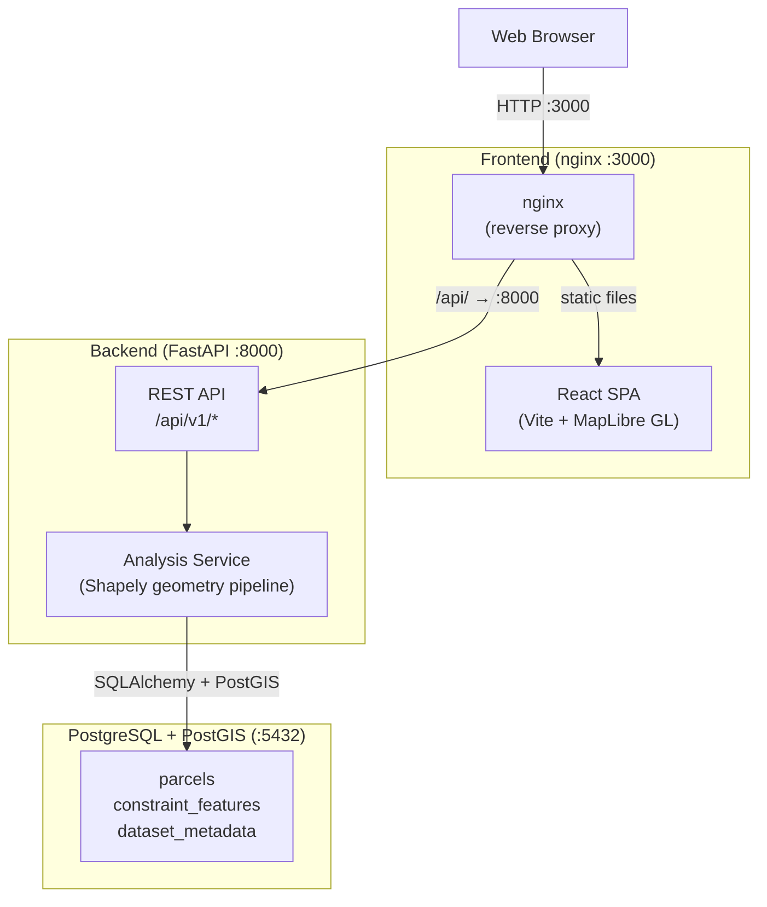

# LandScope: Buildable Land Analysis

LandScope is a web application that determines **buildable land area** for
a parcel after applying environmental and infrastructure constraints
(wetlands, FEMA flood hazard, transmission line corridors) and user-drawn
manual exclusions / restorations.

> ⚠️ **Screening Tool Disclaimer**
>
> LandScope is a **preliminary screening tool only**. It does NOT
> constitute a legal, regulatory, or engineering determination of
> buildability. Wetland delineations, flood zone boundaries, and
> transmission line locations should be verified by qualified
> professionals before any construction or development decisions are
> made. Default buffer distances are planning assumptions, not verified
> regulatory setbacks.

---

## Screenshot

<!-- TODO: Add screenshot of the LandScope UI -->
```
┌─────────────────────────────────────────────────────────┐
│  LandScope — Buildable Land Analysis                     │
├──────────────────────┬──────────────────────────────────┤
│                      │  Parcel:     5.00 ac             │
│                      │  Buildable:   3.42 ac (68.4%)    │
│      Map View        │  Excluded:    1.58 ac (31.6%)    │
│  (MapLibre GL)       │                                  │
│                      │  ┌────────────────────────────┐  │
│                      │  │ Breakdown                  │  │
│                      │  │ Wetlands       0.82 ac     │  │
│                      │  │ Floodplain     0.51 ac     │  │
│                      │  │ Transmission   0.25 ac     │  │
│                      │  └────────────────────────────┘  │
└──────────────────────┴──────────────────────────────────┘
```

---

## Architecture



See [docs/ARCHITECTURE.md](docs/ARCHITECTURE.md) for full architecture
details including sequence diagrams.

---

## Tech Stack

| Layer | Technology | Purpose |
|---|---|---|
| Frontend | React 18, TypeScript, Vite | SPA |
| Map | MapLibre GL JS, react-map-gl | Interactive map |
| State | Zustand, TanStack Query | Client state management |
| Styling | Tailwind CSS | Utility-first CSS |
| Backend | Python 3.12, FastAPI, Pydantic v2 | REST API |
| Geometry | Shapely 2.x, pyproj | Set operations, CRS transforms |
| Database | PostgreSQL 16, PostGIS 3.4 | Spatial data storage |
| ORM | SQLAlchemy 2.x, GeoAlchemy2 | Data access |
| Migrations | Alembic | Schema versioning |
| Logging | structlog | Structured JSON logging |
| Testing | pytest, Vitest, Playwright | Backend, frontend, E2E |
| Linting | Ruff, ESLint | Python and TS linting |
| Type checking | mypy, tsc | Static type checking |
| Containers | Docker, Docker Compose | Containerization |
| CI | GitHub Actions | Automated testing |

---

## Quick Start

```bash
# 1. Copy environment configuration
cp .env.example .env

# 2. Build and start all services
docker compose up --build -d

# 3. Wait for the database to be healthy, then load demo data
make bootstrap
```

Or use the one-command bootstrap script:

```bash
cp .env.example .env
./scripts/bootstrap_demo.sh
```

Once running:

| Service | URL |
|---|---|
| Frontend | http://localhost:3000 |
| Backend API | http://localhost:8000 |
| API Docs (Swagger) | http://localhost:8000/api/docs |
| Health check | http://localhost:8000/health |
| Readiness check | http://localhost:8000/ready |

---

## Demo Data Setup

LandScope ships with **synthetic demo data** for Brazos County, Texas.
The demo data is clearly labeled as `SYNTHETIC DEMO DATA` in all
metadata records — it does NOT represent authoritative wetland,
floodplain, or transmission line information.

To load demo data:

```bash
# Option 1: Full bootstrap (starts services + migrates + seeds)
make bootstrap

# Option 2: Seed only (services must already be running)
make seed

# Option 3: Use the bootstrap script
./scripts/bootstrap_demo.sh
```

This creates:

- **5 demo parcels** around Bryan/College Station, TX
- **4 synthetic wetland** polygons
- **3 synthetic floodplain** polygons (with FEMA-style classifications: AE, A, X)
- **2 synthetic transmission line** corridors
- **3 dataset metadata** records (for attribution)

To load real data from authoritative sources, see
[docs/DATA_SOURCES.md](docs/DATA_SOURCES.md).

---

## Environment Variables

| Variable | Default | Description |
|---|---|---|
| `DATABASE_URL` | `postgresql://postgres:password@db:5432/landscope` | PostgreSQL connection string |
| `ANALYSIS_CRS` | `EPSG:32614` | Projected CRS for area calculations (UTM Zone 14N) |
| `ANALYSIS_CRS_EPSG` | `32614` | EPSG code (integer) for the analysis CRS |
| `DEMO_COUNTY` | `Brazos` | Demo county name |
| `DEMO_COUNTY_FIPS` | `041` | Demo county FIPS code |
| `CORS_ORIGINS` | `http://localhost:5173,http://localhost:3000` | Allowed CORS origins (comma-separated) |
| `LOG_LEVEL` | `INFO` | Logging level (DEBUG, INFO, WARNING, ERROR) |
| `VITE_API_URL` | `http://localhost:8000` | Backend API URL for the frontend |
| `MAX_BUFFER_METERS` | `5000` | Maximum allowed buffer distance (metres) |
| `MAX_MANUAL_FEATURES` | `50` | Maximum manual exclusion/restoration polygons per request |
| `MAX_COORDINATES_PER_FEATURE` | `1000` | Maximum coordinates per manual feature |
| `MAX_PARCEL_SEARCH_LIMIT` | `100` | Maximum parcel search results |

Copy `.env.example` to `.env` and adjust as needed:

```bash
cp .env.example .env
```

---

## Usage Walkthrough

### 1. Select a parcel

- Use the **parcel search** bar to find a parcel by ID or address.
- Or click a **demo parcel bookmark** in the sidebar to load a pre-loaded
  demo parcel.

### 2. Configure constraints

The constraint panel shows four layers:

| Constraint | Default buffer | Toggle |
|---|---|---|
| Wetlands (USFWS NWI) | 30 m | On |
| FEMA Flood Hazard | 0 m | On |
| Transmission Lines (HIFLD) | 30 m | On |
| Manual Exclusion | N/A (user-drawn) | Off |

For each constraint, you can:
- **Toggle** it on/off.
- **Adjust the buffer** distance (metres).
- **Filter by classification** (e.g., only AE flood zones).

### 3. Draw manual exclusions / restorations

- Click **"Draw Exclusion"** to draw a polygon on the map marking an area
  to exclude from buildable land.
- Click **"Draw Restoration"** to override a system constraint (e.g., if
  a wetland delineation is outdated).

### 4. Review results

The summary panel shows:
- **Parcel area** (acres)
- **Buildable area** (acres and % of parcel)
- **Excluded area** (acres and % of parcel)

The **breakdown table** shows per-constraint acreage with non-double-counted
(uniquely attributed) values. Overlapping constraints are attributed to
the highest-priority layer.

### 5. View on the map

The map displays:
- **Parcel boundary** (outline)
- **Buildable area** (green fill)
- **Excluded area** (red fill)
- **Per-constraint exclusion** geometries (colored by layer)
- **Manual exclusion / restoration** polygons

### 6. "How Calculated" drawer

Click **"How is this calculated?"** to see the geometry model, CRS
information, and attribution strategy documentation.

---

## Testing

```bash
# Run backend tests (unit + integration)
make test

# Run frontend unit tests
make test-frontend

# Run E2E tests (app must be running)
make e2e

# Run linting
make lint

# Run type checks
make typecheck

# Check service health
make health
```

### Backend tests

```bash
# Run all backend tests with coverage
docker compose exec backend pytest tests/ -v --tb=short --cov=app --cov-report=term-missing
```

### Frontend tests

```bash
# Unit tests (Vitest)
npm run test

# E2E tests (Playwright)
npm run e2e
```

---

## API Documentation

Interactive API documentation (Swagger UI) is available at:

> **http://localhost:8000/api/docs**

Key endpoints:

| Method | Path | Description |
|---|---|---|
| `GET` | `/health` | Liveness check |
| `GET` | `/ready` | Readiness check (verifies DB connection) |
| `GET` | `/api/v1/parcels` | Search parcels (by county, query, bbox) |
| `GET` | `/api/v1/parcels/{id}` | Get a single parcel |
| `POST` | `/api/v1/analyses` | Run buildable land analysis |
| `GET` | `/api/v1/config` | Get default constraint configuration |
| `GET` | `/api/v1/datasets` | List dataset metadata (attribution) |

---

## Troubleshooting

### Database won't start

```bash
# Check database logs
docker compose logs db

# Verify the database is healthy
docker compose exec db pg_isready -U postgres -d landscope

# If the volume is corrupt, reset it
make clean
docker compose up --build -d
```

### Backend can't connect to database

```bash
# Check DATABASE_URL in the backend container
docker compose exec backend env | grep DATABASE_URL

# Verify the database is reachable from the backend
docker compose exec backend python -c "
from sqlalchemy import create_engine, text
import os
engine = create_engine(os.environ['DATABASE_URL'])
with engine.connect() as conn:
    print(conn.execute(text('SELECT 1')).scalar())
"
```

### Migrations fail

```bash
# Check current migration state
docker compose exec backend alembic current

# View migration history
docker compose exec backend alembic history

# Reset migrations (WARNING: destroys data)
docker compose exec backend alembic downgrade base
docker compose exec backend alembic upgrade head
```

### Frontend shows blank page

```bash
# Check if the frontend build succeeded
docker compose logs frontend

# Verify nginx is serving files
docker compose exec frontend ls /usr/share/nginx/html

# Check if the API is reachable from the frontend container
docker compose exec frontend curl -s http://backend:8000/health
```

### Port already in use

```bash
# Find what's using port 3000 or 8000
lsof -i :3000
lsof -i :8000
lsof -i :5432

# Stop conflicting services or change ports in docker-compose.yml
```

### Demo data not loading

```bash
# Re-run the ingestion script
make seed

# Check for errors
docker compose logs backend | grep -i "ingest"

# Verify data exists
docker compose exec db psql -U postgres landscope -c "SELECT COUNT(*) FROM parcels;"
docker compose exec db psql -U postgres landscope -c "SELECT COUNT(*) FROM constraint_features;"
```

---

## Data Attribution

LandScope uses data from the following providers. All data is from U.S.
federal or state government sources and is in the public domain unless
otherwise noted.

| Dataset | Provider | Source | Licence |
|---|---|---|---|
| Texas Parcels (Brazos County) | TxGIO / TNRIS | [data.tnris.org](https://data.tnris.org/collection/64571f04-4e04-4393-b2d9-b53aa89f2e17) | Public domain |
| National Wetlands Inventory | U.S. Fish & Wildlife Service | [fws.gov](https://www.fws.gov/program/national-wetlands-inventory/wetlands-data) | Public domain |
| National Flood Hazard Layer | FEMA | [msc.fema.gov](https://msc.fema.gov/portal/advanceSearch) | Public domain |
| Electric Transmission Lines | HIFLD | [hifld-geoplatform.opendata.arcgis.com](https://hifld-geoplatform.opendata.arcgis.com/datasets/electric-power-transmission-lines) | Public domain |

> **Note:** The demo data loaded by `scripts/ingest_demo_data.py` is
> **synthetic** and does NOT represent real data from these providers.
> See [docs/DATA_SOURCES.md](docs/DATA_SOURCES.md) for details on
> importing real data.

---

## Screening Disclaimer

**LandScope is a preliminary screening tool only.**

- It does **NOT** constitute a legal, regulatory, or engineering
  determination of buildability.
- Wetland delineations, flood zone boundaries, and transmission line
  locations shown in LandScope should be **verified by qualified
  professionals** before any construction or development decisions.
- Default buffer distances (30 m for wetlands, 30 m for transmission
  lines) are **planning assumptions**, not verified regulatory
  setbacks. Actual setback requirements vary by jurisdiction, feature
  type, and local regulations.
- Manual exclusion and restoration polygons are **user overrides** for
  scenario analysis. They do not modify the underlying data and do not
  constitute official determinations.
- LandScope does **not** guarantee the accuracy, completeness, or
  timeliness of any data or analysis result.

---

## License

This project is licensed under the **MIT License** — see
[LICENSE](LICENSE) for the full text.

The MIT License applies **only to the LandScope application source
code**. It does NOT apply to the datasets referenced or loaded by the
application. Data from TNRIS, USFWS, FEMA, and HIFLD remains under their
respective terms. See [docs/DATA_SOURCES.md](docs/DATA_SOURCES.md) for
details on each dataset's licence.

---

## Documentation

| Document | Description |
|---|---|
| [docs/APPROACH.md](docs/APPROACH.md) | Problem interpretation, geometry model, CRS decision, tradeoffs |
| [docs/ARCHITECTURE.md](docs/ARCHITECTURE.md) | System architecture, sequence diagrams, module responsibilities |
| [docs/DATA_SOURCES.md](docs/DATA_SOURCES.md) | Dataset providers, formats, licences, import instructions |
| [docs/PERFORMANCE.md](docs/PERFORMANCE.md) | Performance characteristics, bottlenecks, scaling strategies |
