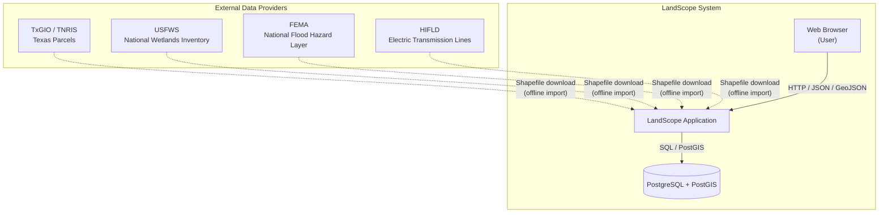
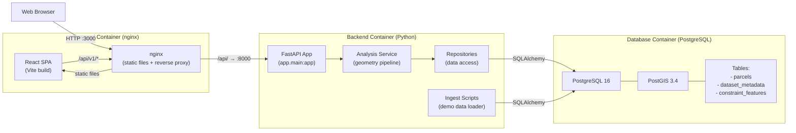
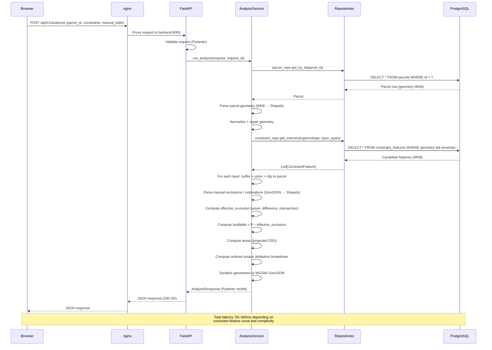
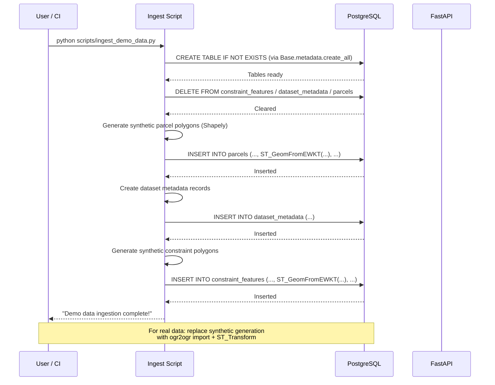

# LandScope: Architecture

This document describes the system architecture of LandScope, including
the system context, container/component structure, request sequences,
data ingestion flow, and module responsibilities.

---

## 1. System Context

LandScope is a web application that helps users determine buildable land
area for a parcel after applying environmental and infrastructure
constraints. It interacts with external data providers (for data
ingestion) and serves a web frontend to end users.

Data from external providers is imported offline (not queried live). The
application stores all data in PostgreSQL/PostGIS and serves it to the web
browser via a REST API.

---

## 2. Container / Component Diagram

LandScope has three containers: a PostgreSQL/PostGIS database, a Python
FastAPI backend, and a React/Vite frontend served by nginx.

### Container details

| Container | Technology | Port | Responsibility |
|---|---|---|---|
| Database | PostgreSQL 16 + PostGIS 3.4 | 5432 | Stores parcels, constraint features, dataset metadata |
| Backend | Python 3.12, FastAPI, uvicorn | 8000 | REST API, geometry analysis, data ingestion |
| Frontend | Node 20 (build), nginx 1.25 (serve) | 3000 | React SPA, reverse proxy to backend |

---

## 3. Request Sequence Diagram

The following sequence shows a typical analysis request from the browser
to the backend and back.

---

## 4. Data Ingestion Sequence

Data is ingested offline via scripts. The demo data ingestion script
creates synthetic data; real data ingestion follows the same pattern but
reads from downloaded shapefiles.

---

## 5. Module Responsibilities

### Backend (`backend/app/`)

| Module | Responsibility |
|---|---|
| `app.main` | FastAPI application factory, middleware setup, health endpoints |
| `app.core.config` | Pydantic settings (env vars, CRS, limits, tolerances) |
| `app.core.logging` | Structured JSON logging via structlog |
| `app.core.exceptions` | Custom exceptions (e.g., `ParcelNotFoundError`) |
| `app.db.base` | SQLAlchemy engine, session factory, `get_db` dependency |
| `app.db.models.parcel` | Parcel ORM model (geometry in EPSG:32614 + WGS84) |
| `app.db.models.constraint_feature` | Constraint feature ORM model |
| `app.db.models.dataset_metadata` | Dataset metadata ORM model (attribution) |
| `app.db.repositories` | Data access layer (parcel repo, constraint repo) |
| `app.geometry.crs` | CRS transformations (WGS84 ↔ analysis CRS via pyproj) |
| `app.geometry.ops` | Geometry operations: buffer, union, difference, intersection, sliver removal, area |
| `app.geometry.serialization` | WKB ↔ Shapely, Shapely ↔ GeoJSON dict |
| `app.schemas.analysis` | Pydantic request/response models for analysis |
| `app.services.analysis_service` | Core analysis pipeline (the geometry model) |
| `app.api.v1.parcels` | Parcel search and lookup endpoints |
| `app.api.v1.analyses` | Analysis endpoint (POST /api/v1/analyses) |
| `app.api.v1.config` | Configuration endpoint (constraint defaults, CRS info) |
| `app.api.v1.datasets` | Dataset metadata endpoint (attribution) |

### Frontend (`src/`)

| Module | Responsibility |
|---|---|
| `src/App.tsx` | Root component, layout, state orchestration |
| `src/api/` | API client (axios), request/response types |
| `src/features/` | Feature components (map, analysis panel, constraint controls) |
| `src/pages/` | Page-level components |
| `src/stores/` | Zustand stores (parcel selection, analysis state) |
| `src/hooks/` | Custom React hooks (React Query wrappers) |
| `src/lib/` | Utilities (formatting, geometry helpers) |
| `src/types/` | TypeScript type definitions |

### Infrastructure

| Component | Responsibility |
|---|---|
| `docker-compose.yml` | Orchestrates db, backend, frontend containers |
| `Dockerfile` (root) | Builds frontend (Vite) and serves via nginx |
| `backend/Dockerfile` | Builds backend (Python, installs deps, runs uvicorn) |
| `nginx.conf` | Reverse proxy: `/api/` → backend, static files for SPA |
| `Makefile` | Developer commands (up, down, test, lint, migrate, seed) |
| `scripts/bootstrap_demo.sh` | One-command demo setup |
| `.github/workflows/ci.yml` | CI: backend tests, frontend tests, Docker build check |

---

## 6. Key Design Principles

1. **All geometry in projected CRS**: Area calculations are always in
   EPSG:32614, never in EPSG:4326 or EPSG:3857. Geometries are stored in
   both CRSs for fast serving.

2. **Application-layer geometry processing**: All set operations (union,
   difference, intersection) are performed in Python with Shapely, not
   in SQL. This keeps the analysis logic testable and debuggable.

3. **Spatial pre-filtering**: Constraint features are loaded via a GiST
   index-backed spatial query (`geometry && envelope`), so only
   candidate features near the parcel are loaded — not the entire
   dataset.

4. **Deterministic, stateless API**: Each analysis request is
   self-contained. No server-side session or result storage. The same
   request always produces the same response.

5. **Screening, not regulatory**: All buffers are planning assumptions.
   The UI and API responses prominently disclaim that LandScope is a
   screening tool.
